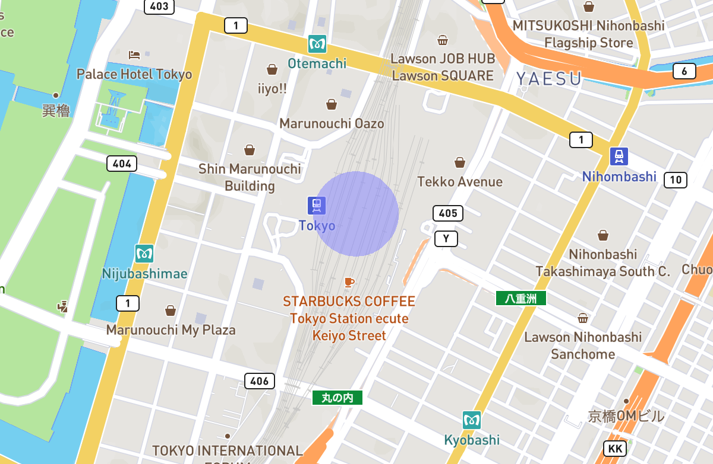

[English](./README.md) / 日本語

# mapbox-geo-circle-layer

[Mapbox GL JS](https://docs.mapbox.com/mapbox-gl-js/guides/)のマップ上にシンプルな円を描画します。

## はじめる

### インストール方法

以下のコマンドを実行してください。
```sh
npm install https://github.com/codemonger-io/mapbox-geo-circle-layer.git#v0.1.0
```

### 事前要件

このライブラリはMapbox GL JSバージョン2.xと組み合わせて使用する前提です。

### 使い方

以下のスニペットでは半透明の青色の円を東京駅周辺の半径100メートルに描画するカスタムレイヤー(`id="example-circle"`)を追加します。
```ts
import { GeoCircleLayer } from 'mapbox-geo-circle-layer';
// map: mapbox-gl.Mapと仮定
map.addLayer(new GeoCircleLayer('example-circle', {
    radiusInMeters: 100,
    center: { lng: 139.7671, lat: 35.6812 },
    fill: { red: 0.25, green: 0.25, blue: 0.5, alpha: 0.5 },
}));
```

以下のようなものが表示されるはずです。


#### プロパティの更新

[`GeoCircleLayer`](./api-docs/markdown/mapbox-geo-circle-layer.geocirclelayer.md)の作成後に以下のプロパティを変更することができます。
- [`radiusInMeters`](./api-docs/markdown/mapbox-geo-circle-layer.geocirclelayer.radiusinmeters.md): 円の半径(メートル)
- [`center`](./api-docs/markdown/mapbox-geo-circle-layer.geocirclelayer.center.md): 円の中心
- [`fill`](./api-docs/markdown/mapbox-geo-circle-layer.geocirclelayer.fill.md): 円を塗りつぶす色
- [`numTriangles`](./api-docs/markdown/mapbox-geo-circle-layer.geocirclelayer.numtriangles.md): 円を近似する三角形の数

上記のプロパティのいずれかを更新すると、[`GeoCircleLayer`](./api-docs/markdown/mapbox-geo-circle-layer.geocirclelayer.md)はマップの再描画をトリガーします。

### APIドキュメント

[`api-docs/markdown`フォルダ](./api-docs/markdown/index.md)を参照ください(英語版のみ)。

## 開発

### Prerequisites

このライブラリをビルドするには[Node.js](https://nodejs.org/en/)のバージョン14以降が必要です。

### 依存関係のインストール

```sh
npm run install
```

### ライブラリのビルド

```sh
npm run build
```

### APIドキュメントの生成

```sh
npm run build:doc
```

これは`npm run build`も実行します。

### 型チェックの実行

ライブラリをビルドすることなく型チェックを実行することができます。

```sh
npm run type-check
```

### テストを実行

```sh
npm test
```

### GitHubワークフロー

`main`ブランチに対してPull RequestもしくはPushが行われると、ターゲットをビルドして検証する[GitHub Actions](https://github.com/features/actions)が開始します。

## このライブラリの代替

### 組み込みのCircleレイヤー

Mapbox GL JSには[組み込みのCircleレイヤー](https://docs.mapbox.com/mapbox-gl-js/style-spec/layers/#circle)があります。
レイヤー上に複数の円を描画することができますが、半径はピクセル(スクリーンユニット)で指定しなければなりません。
なので、地理的なエリアを囲む円を描画するのには適していません。

### mapbox-gl-circle

[`mapbox-gl-circle`](https://github.com/smithmicro/mapbox-gl-circle)はこのライブラリよりも多くの機能を提供しています。
`mapbox-gl-circle`はオプションで円のインタラクティブな編集が可能です。
単純さで`mapbox-geo-circle-layer`を好まれる方もいらっしゃるかもしれません。

### mapbox-gl-draw-circle

[`mapbox-gl-draw-circle`](https://github.com/iamanvesh/mapbox-gl-draw-circle)もこのライブラリよりも多くの機能を提供しています。
`mapbox-gl-draw-circle`は実際のところ[`mapbox-gl-circle`](#mapbox-gl-circle)を用いて実装されています。
単純さで`mapbox-geo-circle-layer`を好まれる方もいらっしゃるかもしれません。