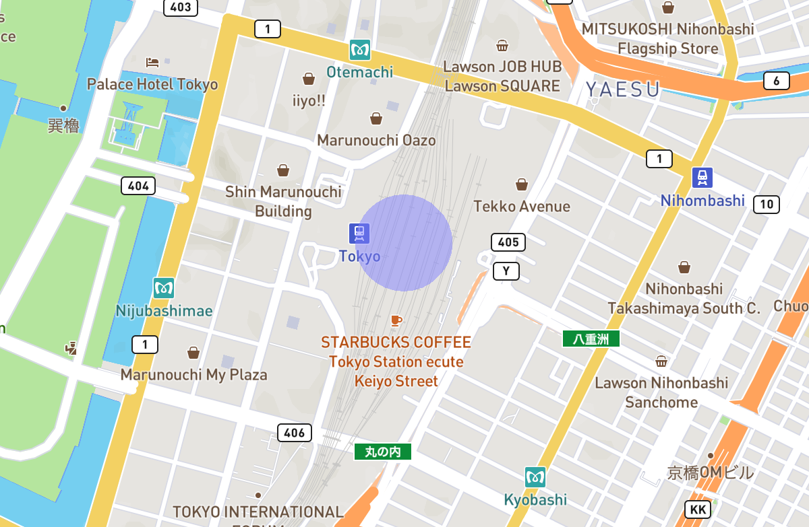

English / [日本語](./README.ja.md)

# mapbox-geo-circle-layer

Renders a simple circle on a [Mapbox GL JS](https://docs.mapbox.com/mapbox-gl-js/guides/) map.

## Getting started

### How to install

Please run the following command:
```sh
npm install https://github.com/codemonger-io/mapbox-geo-circle-layer.git#v0.1.0
```

### Prerequisites

This library is intended to work with Mapbox GL JS v2.x.

### Usage

The following snippet adds a custom layer (`id="example-circle"`) that renders a transparent blue circle with the radius of 100 meters around Tokyo Station:
```ts
import { GeoCircleLayer } from 'mapbox-geo-circle-layer';
// suppose map: mapbox-gl.Map
map.addLayer(new GeoCircleLayer('example-circle', {
    radiusInMeters: 100,
    center: { lng: 139.7671, lat: 35.6812 },
    fill: { red: 0.25, green: 0.25, blue: 0.5, alpha: 0.5 },
}));
```

You will see something like the following,


#### Updating properties

You can change the following properties of a [`GeoCircleLayer`](./api-docs/markdown/mapbox-geo-circle-layer.geocirclelayer.md) after creating it.
- [`radiusInMeters`](./api-docs/markdown/mapbox-geo-circle-layer.geocirclelayer.radiusinmeters.md): radius in meters of the circle
- [`center`](./api-docs/markdown/mapbox-geo-circle-layer.geocirclelayer.center.md): center of the circle
- [`fill`](./api-docs/markdown/mapbox-geo-circle-layer.geocirclelayer.fill.md): fill color of the circle
- [`numTriangles`](./api-docs/markdown/mapbox-geo-circle-layer.geocirclelayer.numtriangles.md): number of triangles to approximate a circle

If you change any of the above properties, [`GeoCircleLayer`](./api-docs/markdown/mapbox-geo-circle-layer.geocirclelayer.md) triggers repaint of the map.

### API documentation

Please refer to the [`api-docs/markdown` folder](./api-docs/markdown/index.md).

## Development

### Installing dependencies

```sh
npm run install
```

### Building the library

```sh
npm run build
```

### Generating the API documentation

```sh
npm run build:doc
```

This also runs `npm run build`.

### Running type check

You can run a type checker without building the library.

```sh
npm run type-check
```

### Running tests

```sh
npm test
```

## Alternatives to this library

### Built-in circle layer

Mapbox GL JS has a [built-in circle layer](https://docs.mapbox.com/mapbox-gl-js/style-spec/layers/#circle).
It can render multiple circles on a layer, but you have to specify radiuses in pixels (screen units).
So it is not suitable for rendering a shape that circles a geographical area.

### mapbox-gl-circle

[`mapbox-gl-circle`](https://github.com/smithmicro/mapbox-gl-circle) offers more features than this library does.
`mapbox-gl-circle` has an optional feature that enables interactive editing of circles.
You might prefer this library for simplicity.

### mapbox-gl-draw-circle

[`mapbox-gl-draw-circle`](https://github.com/iamanvesh/mapbox-gl-draw-circle) also offers more features than this library does.
`mapbox-gl-draw-circle` is actually implemented on top of [`mapbox-gl-circle`](#mapbox-gl-circle).
You might prefer this library for simplicity.